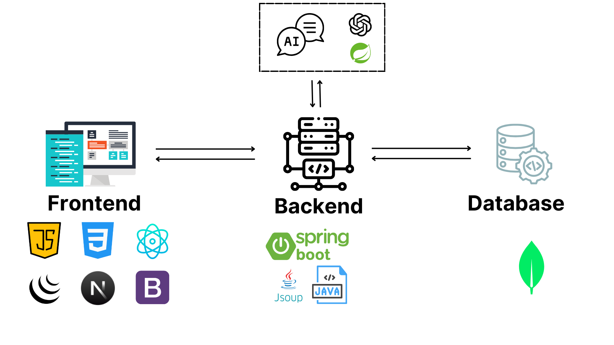

# Ứng dụng hàng đợi và các kỹ thuật xử lý ngôn ngữ tự nhiên để xây dựng công cụ trích xuất và tóm tắt nội dung trang web

## 1. Introduction
 <!-- Thay `link-to-image` bằng liên kết ảnh của bạn -->

Đây là một đồ án môn học thuộc học phần Cấu trúc dữ liệu giải thuật của đại học kinh tế UEH.  
Dự án được lập trình chính bằng ngôn ngữ **Javascript** và **Java**, với các công nghệ được trình bày như hình vẽ.  

Dự án mong muốn tạo ra một ứng dụng web với các chức năng:  
1. Cào dữ liệu HTML từ một trang web hoặc đọc HTML từ một file.  
2. Sử dụng hàng đợi để lọc các đoạn nội dung (content).  
3. Tóm tắt nội dung bằng chatbot.  

---

## 2. Application setup

Để thiết lập dự án, thực hiện các bước sau:

### 2.1. Cài đặt các công cụ cần thiết
1. **Cài đặt npm**  
   Xem chi tiết tại [npm documentation](https://docs.npmjs.com/).
2. **Cài đặt Maven management (mvn)**  
   Xem chi tiết tại [Maven documentation](https://maven.apache.org/).
3. **Thiết lập MongoDB Atlas**  
   Xem chi tiết tại [MongoDB Atlas documentation](https://www.mongodb.com/atlas).
4. **Cài đặt biến môi trường**
   ```bash
   set OPENAI_KEY=<YOUR OPENAI KEY>
   set DATABASE_NAME=<YOUR Mongodb DB name>
   set DATABASE_URI=<YOUR DB URI>
   ```

### 2.2. Sao chép và thiết lập dự án
Clone dự án từ GitHub:
```bash
git clone [<project-repo-link> # Thay <project-repo-link> bằng liên kết dự án của bạn](https://github.com/dinhtanloc/Scrawler-Web-data-using-DSA-Algorithm.git)
```

Tại thư mục chính của dự án, sử dụng terminal để thiết lập các thư mục con:

#### Frontend
```bash
cd frontend
npm i
npm run dev
```
Frontend sẽ được chạy ở cổng `3000`.

#### Backend
```bash
cd backend
mvn clean install
mvn spring-boot:run
```
Backend sẽ được chạy ở cổng `8080`.


#### Database
```bash
COLLECTION_NAME: chunks
```

---

### Ghi chú
- Cần đảm bảo các biến môi trường được thiết lập chính xác.  
- Hãy kiểm tra tài liệu hướng dẫn chi tiết trong các liên kết bên trên nếu gặp vấn đề.

## 3. Báo cáo đồ án và kết thúc môn
- Đây là báo cáo đồ án chi tiết  [Docs](Link)
- Link video demo ở đây: [Video Demo](https://drive.google.com/file/d/1Vd2LzUqRjacyMe_mfIbyYexcm882idSw/view?usp=sharing)
